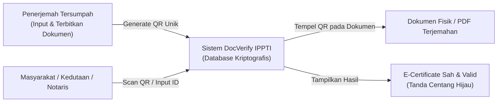
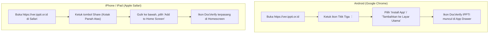

# PANDUAN LENGKAP PENGGUNAAN SISTEM DOCVERIFY IPPTI
**Sistem Verifikasi & Integritas Dokumen Terjemahan Resmi Ikatan Penerjemah Indonesia (IPPTI)**

---

## DAFTAR ISI
1. [Pendahuluan & Gambaran Umum Sistem](#1-pendahuluan--gambaran-umum-sistem)
2. [BAGIAN 1: Panduan Masyarakat Umum & Instansi Pengguna](#bagian-1-panduan-masyarakat-umum--instansi-pengguna)
   - 1.1 [Verifikasi Keaslian Dokumen Terjemahan via Pindai QR Code](#11-verifikasi-keaslian-dokumen-terjemahan-via-pindai-qr-code)
   - 1.2 [Verifikasi Dokumen via Pencarian Manual di Portal Web](#12-verifikasi-dokumen-via-pencarian-manual-di-portal-web)
   - 1.3 [Memahami Anatomi E-Certificate Hasil Verifikasi](#13-memahami-anatomi-e-certificate-hasil-verifikasi)
   - 1.4 [Mengunduh E-Certificate Resmi (A4 Single-Page PDF)](#14-mengunduh-e-certificate-resmi-a4-single-page-pdf)
   - 1.5 [Peringatan Status Dokumen Dibatalkan / Dicabut (Revoked)](#15-peringatan-status-dokumen-dibatalkan--dicabut-revoked)
   - 1.6 [Verifikasi Keabsahan Profil Penerjemah Tersumpah](#16-verifikasi-keabsahan-profil-penerjemah-tersumpah)
3. [BAGIAN 2: Panduan Pengguna Penerjemah Tersumpah (Sworn Translator)](#bagian-2-panduan-pengguna-penerjemah-tersumpah-sworn-translator)
   - 2.1 [Pendaftaran Akun Baru & Login](#21-pendaftaran-akun-baru--login)
   - 2.2 [Input Dokumen Terjemahan Baru (Tunggal)](#22-input-dokumen-terjemahan-baru-tunggal)
   - 2.3 [Mengunduh & Memasang Stempel QR Code pada Dokumen Fisik](#23-mengunduh--memasang-stempel-qr-code-pada-dokumen-fisik)
   - 2.4 [Impor Data Dokumen Massal (Excel Batch Import)](#24-impor-data-dokumen-massal-excel-batch-import)
   - 2.5 [Pencabutan / Pembatalan Dokumen (Revoke QR)](#25-pencabutan--pembatalan-dokumen-revoke-qr)
   - 2.6 [Manajemen Saldo Poin, Top-Up, & Upgrade Mode PRO](#26-manajemen-saldo-poin-top-up--upgrade-mode-pro)
   - 2.7 [Panduan Pemasangan Aplikasi Mobile (PWA di Android & iPhone)](#27-panduan-pemasangan-aplikasi-mobile-pwa-di-android--iphone)
4. [BAGIAN 3: Panduan Administrator IPPTI (Admin & Super Admin)](#bagian-3-panduan-administrator-ippti-admin--super-admin)
   - 3.1 [Manajemen & Verifikasi Akun Penerjemah](#31-manajemen--verifikasi-akun-penerjemah)
   - 3.2 [Monitoring & Audit Registrasi Dokumen Nasional](#32-monitoring--audit-registrasi-dokumen-nasional)
   - 3.3 [Laporan Keuangan & Rekap Bagi Hasil 50% IPPTI : 50% Benlaris](#33-laporan-keuangan--rekap-bagi-hasil-50-ippti--50-benlaris)
   - 3.4 [Pengelolaan Kode Voucher Diskon](#34-pengelolaan-kode-voucher-diskon)
   - 3.5 [Manajemen Master Data & Audit Trail Sistem](#35-manajemen-master-data--audit-trail-sistem)
5. [Tanya Jawab Umum (FAQ) & Pusat Bantuan](#5-tanya-jawab-umum-faq--pusat-bantuan)

---

## 1. Pendahuluan & Gambaran Umum Sistem

**DocVerify IPPTI** adalah platform resmi berbasis komputasi awan dan PWA (*Progressive Web App*) yang dikembangkan untuk menjamin keaslian, integritas hukum, dan ketertelusuran dokumen hasil terjemahan penerjemah tersumpah anggota IPPTI di seluruh wilayah Negara Kesatuan Republik Indonesia.

Setiap dokumen terjemahan resmi yang terdaftar akan memiliki kode QR verifikasi unik yang terikat secara kriptografis dengan identitas penerjemah tersumpah, nomor SK Menteri Hukum Republik Indonesia, nomor registrasi buku, dan identitas dokumen.

---

## BAGIAN 1: Panduan Masyarakat Umum & Instansi Pengguna
*(Ditujukan bagi: Klien pemilik dokumen, Kedutaan Besar Asing, Notaris, Kementerian Hukum & HAM, Kementerian Luar Negeri, Pengadilan, Kepolisian, dan Perusahaan)*

### 1.1 Verifikasi Keaslian Dokumen Terjemahan via Pindai QR Code
Cara tercepat untuk memverifikasi dokumen fisik atau berkas digital hasil terjemahan adalah menggunakan kamera smartphone:

1. Buka aplikasi **Kamera** bawaan pada smartphone Anda (Android atau iPhone) atau gunakan aplikasi pemindai QR (*QR Code Scanner*).
2. Arahkan lensa kamera ke gambar **QR Code DocVerify IPPTI** yang tercetak pada lembar sertifikasi dokumen terjemahan (biasanya berada di sudut kanan bawah atau di samping tanda tangan dan cap basah penerjemah).
3. Ketuk tautan URL notifikasi yang muncul di layar (contoh: `https://ver.ippti.or.id/verify/KVUANAYA`).
4. Peramban web akan langsung membuka halaman **E-Certificate Hasil Verifikasi**.

> [!NOTE]
> Pada tampilan mobile/smartphone, sistem secara otomatis menampilkan header ramah pandang dengan **ikon centang hijau besar** di posisi tengah jika dokumen dinyatakan sah dan valid, sehingga memudahkan petugas imigrasi/notaris untuk validasi kilat.

---

### 1.2 Verifikasi Dokumen via Pencarian Manual di Portal Web
Jika Anda sedang menggunakan komputer desktop atau tidak dapat memindai QR code secara langsung:

1. Kunjungi alamat portal resmi: **`https://ver.ippti.or.id`**.
2. Pada tab **Nomor Registrasi**, masukkan salah satu kata kunci berikut:
   * **Nomor Registrasi Dokumen** (contoh: `1324/2026` atau `REG-ENG-001`), ATAU
   * **ID Dokumen Unik 8-Karakter** (contoh: `KVUANAYA`), ATAU
   * **Nama Pemilik Dokumen** yang tertera pada berkas.
3. Klik tombol panah biru (**Cari / Periksa**).
4. Jika ditemukan satu dokumen yang cocok, sistem akan langsung mengarahkan Anda ke sertifikat elektronik. Jika ada beberapa dokumen dengan nama serupa, sistem akan menampilkan jendela pilihan *disambiguasi* yang aman.

---

### 1.3 Memahami Anatomi E-Certificate Hasil Verifikasi
Dokumen yang sah dan terdaftar resmi di IPPTI akan menampilkan e-sertifikat berkeamanan tinggi dengan ornamen bingkai resmi (*Guilloche Border*):

#### Komponen Utama yang Wajib Diperiksa:
1. **Status Verifikasi (Pita Hijau VERIFIED)**: Menandakan status dokumen terdaftar aktif dan belum pernah dicabut.
2. **Nomor Registrasi & ID Dokumen**: Nomor unik dokumen yang dicocokkan dengan lembar fisik terjemahan.
3. **Nama di Dokumen (Disamarkan / Masked)**: Demi kepatuhan terhadap regulasi Perlindungan Data Pribadi (UU PDP), nama klien disamarkan sebagian (contoh: `G***** I***** S******`), namun tetap cukup untuk dicocokkan dengan dokumen asli yang Anda pegang.
4. **Identitas Penerjemah Tersumpah**:
   * Nama lengkap penerjemah tersumpah beserta gelar.
   * Pasangan/Arah bahasa resmi (contoh: *Indonesia - Jerman*).
   * Nomor Anggota Resmi IPPTI (contoh: `25008`).
   * **SK Menteri Hukum Republik Indonesia**: Nomor SK pengangkatan resmi dari kementerian beserta tanggal penetapannya.
5. **Waktu Verifikasi**: Menampilkan tanggal dan jam presisi saat verifikasi elektronik dilakukan.
6. **Stempel Hologram IPPTI & Kode QR**: Mengandung tanda tangan kriptografis sistem yang tidak dapat dipalsukan.
7. **Pilihan Bahasa Internasional**: Di sudut atas tersedia tombol alih bahasa (**ID** Bahasa Indonesia, **EN** English, **ZH** Mandarin, **AR** Arab) yang memudahkan pengecekan oleh kedutaan besar asing di seluruh dunia.

---

### 1.4 Mengunduh E-Certificate Resmi (A4 Single-Page PDF)
Untuk arsip notaris, lampiran berkas visa di kedutaan, atau bukti pemeriksaan instansi:

1. Gulir ke bagian bawah halaman sertifikat verifikasi.
2. Klik tombol hijau **Download PDF**.
3. Sistem secara instan mencetak salinan *Single-Page A4 PDF* resmi beresolusi tinggi tanpa terpotong (*zero split*), lengkap dengan seluruh stempel dan nomor sertifikat elektronik.

---

### 1.5 Peringatan Status Dokumen Dibatalkan / Dicabut (Revoked)
Jika penerjemah tersumpah menarik kembali dokumen akibat pembatalan pesanan, kesalahan data asli klien, atau terindikasi manipulasi berkas fisik, sistem akan menampilkan indikator visual tegas:

> [!CAUTION]
> **Peringatan Dokumen Dicabut (REVOKED)**: Jika Anda melihat status berwarna merah dengan keterangan *"Dokumen terjemahan dengan nomor registrasi ini telah dicabut atau dibatalkan oleh penerjemah yang bersangkutan"*, dokumen tersebut **TIDAK LAGI BERLAKU** untuk keperluan hukum maupun administrasi resmi apa pun.

---

### 1.6 Verifikasi Keabsahan Profil Penerjemah Tersumpah
Masyarakat dan instansi dapat memastikan apakah seorang penerjemah benar-benar tersumpah dan merupakan anggota aktif IPPTI:

1. Buka menu **Verifikasi Penerjemah** pada bilah navigasi atas (atau kunjungi URL `/verify-translator`).
2. Masukkan nama lengkap penerjemah atau Nomor Anggota IPPTI (contoh: `25001` atau `Zenzia`).
3. Klik tombol **Cari Penerjemah**.
4. Sistem akan menampilkan **IPPTI Official Registry Card**:

#### Informasi yang Ditampilkan:
* **Status Keanggotaan**: *ACTIVE & REGISTERED* (Centang Hijau).
* **Nomor Anggota IPPTI & Nama Lengkap**: Terdaftar resmi pada pangkalan data IPPTI pusat.
* **Dasar Hukum Penetapan**: Nomor dan tanggal SK Menteri Hukum Republik Indonesia / Menkumham.
* **Pasangan Bahasa Berizin**: Daftar bahasa yang berwenang diterjemahkan secara tersumpah oleh penerjemah tersebut.
* **Masa Berlaku Registrasi**: Seumur Hidup (*sesuai ketentuan regulasi penerjemah tersumpah yang berlaku*).

---

## BAGIAN 2: Panduan Pengguna Penerjemah Tersumpah (Sworn Translator)
*(Ditujukan bagi: Seluruh Penerjemah Tersumpah Anggota IPPTI yang memiliki wewenang menerbitkan dokumen terjemahan)*

### 2.1 Pendaftaran Akun Baru & Login
1. Buka halaman utama DocVerify IPPTI, lalu klik **Daftar Sebagai Penerjemah** (atau akses `/register`).
2. Isi formulir registrasi secara akurat:
   * **Nama Lengkap & Gelar** (sesuai yang tercantum pada SK Menteri Hukum).
   * **Nomor Anggota IPPTI** (contoh: `25008`).
   * **Nomor SK Menteri Hukum Republik Indonesia** (contoh: `AHU-56 AH.03.07.2022`).
   * **Tanggal SK**: Tanggal pengesahan SK pengangkatan.
   * **Layanan Bahasa**: Pasangan bahasa kewenangan (contoh: *Indonesia - Inggris, Inggris - Indonesia*).
   * **Email Aktif & Password Akun**.
3. Klik tombol **Daftar Sekarang**. Setelah akun diverifikasi oleh admin IPPTI, Anda dapat langsung login.

---

### 2.2 Input Dokumen Terjemahan Baru (Tunggal)
Setiap kali menyelesaikan satu pesanan terjemahan resmi, daftarkan dokumen tersebut ke sistem untuk menerbitkan kode QR verifikasinya:

1. Masuk ke panel dashboard penerjemah, lalu klik tombol **+ Tambah Dokumen Baru** (menu `/admin/new`).
2. Lengkapi formulir registrasi dokumen:
   * **Nama Pemilik Dokumen / Klien**: Ketik nama pemilik berkas (misal: *Andi Pratama*). Sistem akan otomatis menyamarkan nama ini untuk tampilan publik demi privasi.
   * **Nomor Registrasi Dokumen (Buku Register)**: Nomor agenda penerjemahan Anda (misal: `TS/REG/2026/1024`).
   * **Tipe Dokumen**: Pilih dari dropdown (*Akta Kelahiran, Ijazah, Surat Nikah, Perjanjian Kontrak, Putusan Pengadilan, KTP, dll.*).
   * **Arah / Pasangan Bahasa**: Pilih arah bahasa terjemahan (*Indonesia - Inggris*, dll.).
   * **Tanggal Terjemahan**: Tanggal diterbitkannya berkas terjemahan.
3. Klik tombol **Simpan & Terbitkan Kode QR**.
4. Sistem secara otomatis memotong poin kuota verifikasi dan membuat ID Dokumen unik 8-karakter (misal: `KVUANAYA`).

---

### 2.3 Mengunduh & Memasang Stempel QR Code pada Dokumen Fisik
Setelah dokumen berhasil disimpan, Anda akan diarahkan ke tabel berkas dokumen:

1. Temukan baris dokumen yang baru saja Anda buat.
2. Pada kolom **Aksi**, klik ikon **QR Code**.
3. Pilih opsi pengunduhan:
   * **Unduh PNG (Resolusi Tinggi)**: Untuk ditempelkan langsung ke dalam layout dokumen Microsoft Word / Adobe InDesign sebelum dicetak.
   * **Cetak Lembar Stempel QR**: Untuk langsung dicetak pada kertas stiker label atau kertas biasa.
4. **Posisi Pemasangan Rekomendasi**:
   * Tempelkan kode QR di **lembar terakhir dokumen terjemahan**, berdampingan dengan stempel basah, nomor register buku, dan tanda tangan Anda.
   * Cantumkan keterangan singkat di bawah QR: *"Pindai kode QR untuk verifikasi keabsahan terjemahan di portal resmi IPPTI"*.

---

### 2.4 Impor Data Dokumen Massal (Excel Batch Import)
Jika Anda memiliki puluhan dokumen dalam satu proyek terjemahan korporat:

1. Pada halaman **Data Dokumen**, klik tombol **Impor Excel**.
2. Klik **Unduh Template Excel** (`template-impor-dokumen.xlsx`).
3. Buka template tersebut dan isi data sesuai kolom:
   * `nomor_registrasi`: Nomor agenda register penerjemah.
   * `nama_klien`: Nama pemilik berkas.
   * `tipe_dokumen`: Nama jenis dokumen sesuai master data.
   * `arah_bahasa`: Pasangan bahasa terjemahan.
   * `tanggal_terjemah`: Format tanggal `YYYY-MM-DD`.
4. Unggah berkas Excel yang sudah diisi ke modal pop-up impor.
5. Sistem akan memvalidasi data dan menerbitkan puluhan kode QR secara otomatis dalam hitungan detik.

---

### 2.5 Pencabutan / Pembatalan Dokumen (Revoke QR)
Apabila klien membatalkan pesanan, terdapat revisi fatal pada berkas asli yang menuntut penerbitan ulang nomor register baru, atau terdapat indikasi penyalahgunaan:

1. Buka tabel **Data Dokumen**.
2. Cari dokumen yang bersangkutan, lalu klik tombol merah **Cabut QR**.
3. Masukkan alasan pencabutan dokumen pada kolom konfirmasi.
4. Klik **Konfirmasi Pencabutan**.
5. Status dokumen akan langsung berubah menjadi **Revoked**. Kode QR pada dokumen fisik yang sudah terlanjur beredar akan menampilkan peringatan pembatalan warna merah jika dipindai oleh pihak manapun.

---

### 2.6 Manajemen Saldo Poin, Top-Up, & Upgrade Mode PRO
Setiap penerbitan satu QR verifikasi membutuhkan saldo poin operasional:

1. **Memeriksa Saldo Poin**:
   * Jumlah saldo poin aktif Anda selalu ditampilkan di sudut kiri bawah sidebar.
2. **Aktivasi Paket Mode PRO**:
   * Klik menu **Upgrade Mode PRO**.
   * Paket PRO memberikan keuntungan akses tanpa batas, diskon biaya verifikasi, serta lencana *PRO Sworn Translator* pada sertifikat publik.
   * Klik tombol **Bayar & Aktivasi Mode PRO**.
3. **Pembayaran Instan via QRIS Xenith Pay**:
   * Sistem akan menampilkan pop-up pembayaran resmi Xenith Pay.
   * Pindai kode QRIS menggunakan aplikasi e-wallet (GoPay, OVO, Dana, ShopeePay) atau Mobile Banking (BCA, Mandiri, BRI, BNI).
   * Begitu pembayaran terkonfirmasi, status akun dan saldo poin akan bertambah secara instan secara *realtime* tanpa perlu konfirmasi manual.

---

### 2.7 Panduan Pemasangan Aplikasi Mobile (PWA di Android & iPhone)
DocVerify IPPTI telah dilengkapi teknologi *Progressive Web App* (PWA) sehingga dapat dipasang langsung pada layar utama HP seperti aplikasi App Store atau Google Play Store:

* **Keuntungan PWA**: Buka aplikasi dengan sekali ketuk, tampilan layar penuh (*standalone without browser address bar*), akses tabel dokumen lebih cepat, dan kamera QR scanner yang lebih responsif.

---

## BAGIAN 3: Panduan Administrator IPPTI (Admin & Super Admin)
*(Ditujukan bagi: Pengurus Pusat IPPTI, Divisi Keuangan, Administrator Sistem, dan Dewan Pembina)*

### 3.1 Manajemen & Verifikasi Akun Penerjemah
Admin bertanggung jawab menjaga kredibilitas seluruh akun penerjemah tersumpah yang terdaftar di platform:

1. Buka menu **Manajemen Pengguna / Penerjemah** (`/admin/users`).
2. **Memverifikasi Akun Baru**:
   * Periksa kesesuaian Nama Penerjemah, Nomor Anggota IPPTI, dan Nomor SK Menteri Hukum Republik Indonesia yang diinput pendaftar.
   * Pastikan tanggal SK dan pasangan bahasa kewenangannya sesuai dengan berkas fisik di sekretariat IPPTI.
3. **Mengubah Role / Status Akun**:
   * Klik tombol **Edit** pada baris pengguna.
   * Anda dapat menetapkan role sebagai *Penerjemah*, *Pengurus IPPTI (Admin)*, atau *Super Admin*.
4. **Reset Kata Sandi**:
   * Jika penerjemah mengalami kendala login, klik tombol **Reset Password** untuk membuatkan kata sandi sementara atau mengirim tautan pemulihan.

---

### 3.2 Monitoring & Audit Registrasi Dokumen Nasional
Admin dapat memantau seluruh dokumen yang diterbitkan oleh seluruh anggota di seluruh Indonesia secara terpusat:

1. Buka menu **Dasbor Dokumen** (`/admin`).
2. Gunakan fitur penyaringan (*filter*) untuk melihat:
   * Dokumen berdasarkan penerjemah tertentu.
   * Dokumen berdasarkan tanggal terbit atau jenis bahasa.
   * Dokumen yang berstatus *Verified* vs *Revoked*.
3. Setiap entri memiliki catatan audit digital yang merekam waktu pembuatan dokumen secara akurat.

---

### 3.3 Laporan Keuangan & Rekap Bagi Hasil 50% IPPTI : 50% Benlaris
DocVerify IPPTI memiliki modul transparansi keuangan otomatis yang membagi setiap pemasukan top-up poin secara adil antara organisasi IPPTI dan tim pengembang:

#### Struktur Monitoring Finansial:
1. **Saldo Kas Gateway**: Menampilkan saldo *realtime* dana yang mengendap pada payment gateway Xenith Pay yang siap ditarik.
2. **Total Pemasukan (Inflow)**: Total akumulasi dana rupiah dari seluruh pembayaran top-up penerjemah tersumpah.
3. **Porsi Hak Bagi Hasil IPPTI (50%)**: Alokasi dana bersih untuk kas organisasi IPPTI yang akan ditransfer ke rekening resmi **Bank BCA (5555637653 a.n. Ikatan Penerjemah Indonesia)**.
4. **Porsi Hak Bagi Hasil Benlaris (50%)**: Alokasi dana untuk pemeliharaan infrastruktur server, lisensi payment gateway, dan pengembangan sistem yang ditransfer ke rekening resmi **Bank Mandiri (1370019283741 a.n. PT Benlaris Sahabat Dewata)**.
5. **Riwayat Transaksi Top-Up Poin Masuk**: Tabel rincian setiap transaksi per nomor pesanan, nama penerjemah, nominal IDR, poin yang diterbitkan, kanal pembayaran (QRIS / VA), status pelunasan, dan waktu transaksi.

---

### 3.4 Pengelolaan Kode Voucher Diskon
Untuk program promosi organisasi atau stimulus bagi penerjemah baru:

1. Buka menu **Kode Voucher** (`/admin/vouchers`).
2. Klik tombol **+ Buat Voucher Baru**.
3. Tentukan konfigurasi voucher:
   * **Kode Voucher**: Kode unik huruf kapital (misal: `IPPTIBERKAH2026`).
   * **Tipe Diskon**: Potongan Nominal Tetap (Rp) atau Persentase (%).
   * **Nilai Diskon**: Besaran potongan harga top-up.
   * **Batas Maksimal Penggunaan**: Kuota pemakaian (misal: 100 kali).
   * **Tanggal Kedaluwarsa**: Batas akhir voucher dapat diklaim.
4. Klik **Simpan Voucher**. Voucher yang aktif dapat langsung digunakan oleh penerjemah pada form checkout top-up poin.

---

### 3.5 Manajemen Master Data & Audit Trail Sistem
1. **Master Tipe Dokumen** (`/admin/document-types`):
   * Tambah atau nonaktifkan jenis dokumen yang dapat dipilih penerjemah (misal: penambahan *Akta Notaris*, *Surat Kuasa Khusus*, dll.).
2. **Master Arah Bahasa** (`/admin/language-directions`):
   * Menyesuaikan pasangan bahasa resmi yang diakui oleh organisasi IPPTI.
3. **Audit Trail & System Logs** (`/admin/audit-logs`):
   * Merekam setiap aksi penting pengguna: login, pembuatan dokumen, pengubahan profil SK, pencabutan dokumen, hingga penarikan dana. Hal ini mencegah manipulasi data dari pihak internal maupun eksternal.

---

## 5. Tanya Jawab Umum (FAQ) & Pusat Bantuan

**Q1: Apakah hasil pindai QR DocVerify IPPTI diakui oleh Kedutaan Asing?**
> **Ya.** E-Certificate DocVerify IPPTI dirancang memenuhi standar verifikasi internasional dengan 4 pilihan bahasa (Indonesia, Inggris, Mandarin, Arab), mencantumkan nomor SK Menteri Hukum Republik Indonesia resmi, dan dapat diakses publik 24/7.

**Q2: Mengapa nama pemilik dokumen disamarkan sebagian dengan tanda bintang (`*`)?**
> Hal ini dilakukan demi mematuhi Undang-Undang Perlindungan Data Pribadi (UU PDP) dan standar keamanan informasi internasional, sehingga data pribadi klien tidak disalahgunakan oleh pihak ketiga yang tidak berkepentingan yang memindai kode QR tersebut.

**Q3: Bagaimana jika ada kesalahan ketik pada data dokumen yang sudah terbit?**
> Penerjemah dapat mengedit data dokumen melalui dashboard (`/admin/edit/{id}`) selama dokumen belum dicabut, atau mencabut QR lama dan menerbitkan nomor registrasi baru jika perubahan bersifat substansial.

**Q4: Ke mana admin atau penerjemah dapat menghubungi jika mengalami kendala teknis?**
> * **Sekretariat IPPTI**: Gedung Menara Caraka Lt. 6/625, Mega Kuningan, Jakarta Selatan.
> * **Email Dukungan Sistem**: `info@ippti.or.id`
> * **WhatsApp Hotline**: `+62 811-8117-0118`

---
*Buku Panduan Resmi DocVerify IPPTI — Hak Cipta Dilindungi Undang-Undang. Ikatan Penerjemah Indonesia (IPPTI) & Benlaris.*
