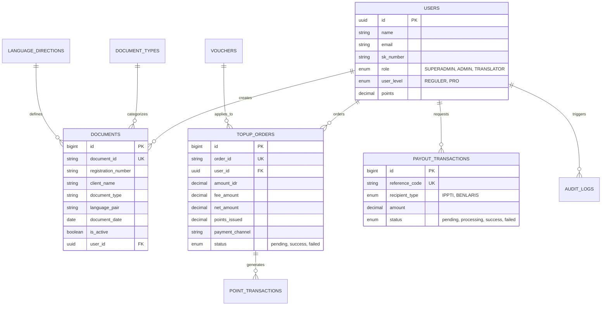

# PRODUCT REQUIREMENT DOCUMENT (PRD)
## DocVerify IPPTI - Portal Verifikasi & Manajemen Dokumen Terjemahan Resmi

---

### DOKUMEN INFORMASI
* **Nama Produk**: DocVerify IPPTI
* **Versi Produk**: 2.0 (Production Ready & PWA Enabled)
* **Pemilik Produk**: Ikatan Penerjemah Indonesia (IPPTI) & PT Benlaris Sukses Indonesia
* **Tanggal Penyusunan**: 21 Agustus 2026
* **Status Dokumen**: Approved / Released
* **Teknologi**: Laravel 11, PHP 8.2+, Tailwind CSS, Xenith Pay Gateway API, PWA (Progressive Web App)

---

## 1. EKSEKUTIF SUMMARY & TUJUAN BISNIS

### 1.1 Latar Belakang & Permasalahan
1. **Maraknya Pemalsuan Berkas**: Dokumen terjemahan tersumpah (seperti Akta Kelahiran, Ijazah, Putusan Pengadilan, Kontrak Bisnis) rawan dipalsukan stempel dan tanda tangannya oleh oknum tak bertanggung jawab.
2. **Proses Verifikasi Manual Lambat**: Kedutaan besar asing, instansi pemerintah (Kemenkumham, Kemlu), notaris, dan korporasi membutuhkan waktu lama untuk memverifikasi keabsahan lisensi penerjemah tersumpah secara fisik.
3. **Kebutuhan Transparansi Keuangan Organisasi**: Pengurus IPPTI memerlukan sistem terautomasi untuk mengelola registrasi dokumen, saldo poin penerjemah, dan pembagian hasil (revenue sharing) yang akuntabel dan real-time.

### 1.2 Tujuan Produk (Product Objectives)
* **Autentikasi Digital Instan**: Menghasilkan QR Code verifikasi dinamis beresolusi tinggi pada setiap lembar dokumen terjemahan resmi.
* **Direktori Penerjemah Tersumpah Terpadu**: Menyediakan portal pencarian publik untuk memverifikasi SK Penetapan dan nomor anggota IPPTI penerjemah.
* **Otomasi Monetisasi & Payment Gateway**: Mengintegrasikan Xenith Pay untuk top-up saldo poin penerjemah secara otomatis melalui QRIS dan Virtual Account Bank.
* **Skema Bagi Hasil 50:50 Realtime**: Menghitung secara otomatis alokasi bagi hasil 50% IPPTI dan 50% Benlaris berdasarkan saldo bersih (*net balance*) real di gateway.
* **Mobilitas PWA (Progressive Web App)**: Memungkinkan sistem diakses dan diinstall selayaknya aplikasi native di Android dan iPhone (iOS).

---

## 2. HIRARKI PENGGUNA & PERAN (USER ROLES & PERMISSIONS)

| Peran (Role) | Hak Akses Utama | Deskripsi Peran |
| :--- | :--- | :--- |
| **Public User** | `Public` (No Login) | Scan QR Code dokumen, cari profil penerjemah tersumpah, validasi status SK & keanggotaan IPPTI. |
| **Penerjemah (Reguler)** | `auth` (Role: TRANSLATOR) | Input dokumen manual/Excel, unduh QR Code, top-up poin, klaim voucher, kelola profil. |
| **Penerjemah (PRO)** | `auth` (Role: TRANSLATOR, Level: PRO) | Semua fitur Reguler + Lencana Emas PRO VERIFIED, prioritas direktori, fitur branding stempel. |
| **Admin IPPTI** | `auth` (Role: ADMIN / SUPERADMIN) | Kelola anggota, verifikasi dokumen, laporan keuangan & bagi hasil 50:50, buat voucher promo, master data. |
| **Super Admin** | `auth` (Role: SUPERADMIN) | Hak akses penuh nasional: Portal Audit Registrasi, Log Audit Security Trail, Konfigurasi Gateway & Rekening Payout. |

---

## 3. MODUL FITUR & PERSYARATAN FUNGSIONAL

```mermaid
graph TD
    A[DocVerify IPPTI Platform] --> B[Modul Publik & Verifikasi]
    A --> C[Modul Penerjemah & Dokumen]
    A --> D[Modul Monetisasi & Xenith Pay]
    A --> E[Modul Keuangan & Bagi Hasil 50:50]
    A --> F[Modul Admin & Audit Trail]
    A --> G[Modul PWA Mobile App]

    B --> B1[Scan QR Code Verifikasi]
    B --> B2[Direktori SK Penerjemah]
    
    C --> C1[Input Dokumen Manual]
    C --> C2[Impor Massal Excel xlsx]
    C --> C3[Unduh QR Code PNG]

    D --> D1[Top-Up Poin Auto Callback]
    D --> D2[Voucher Diskon 100% Free Pass]
    D --> D3[Upgrade Mode PRO]

    E --> E1[Kas Bersih Real Xenith]
    E --> E2[Split 50% IPPTI : 50% Benlaris]
    E --> E3[Payout Rekening Organisasi]

    F --> F1[Audit Trail Log]
    F --> F2[Master Tipe & Bahasa]

    G --> G1[Mobile Drawer & Dock Bar]
    G --> G2[PWA Install Android & iOS]
```

### 3.1 Modul 1: Verifikasi Publik & Direktori Penerjemah
* **F-01.1 Scan QR Code Dokumen (`/verify/{documentId}`)**:
  * Menampilkan halaman verifikasi publik tanpa perlu login.
  * Menampilkan lencana status keabsahan (*DOKUMEN TERDAFTAR RESMI*), Nomor Registrasi, Nama Pemilik/Klien, Jenis Dokumen, Pasangan Bahasa, Tanggal Terbit, dan Nama Penerjemah Bersumpah.
  * Rate-limiting keamanan (Throttle 60 request/menit).
* **F-01.2 Direktori Penerjemah Tersumpah (`/verify-translator`, `/search-translators`)**:
  * Pencarian publik berdasarkan Nama Lengkap, Nomor Anggota IPPTI, atau Nomor SK Penetapan.
  * Menampilkan detail profil resmi, status keanggotaan aktif IPPTI, dan sertifikasi bahasa.
* **F-01.3 API Check Member (`/api/check-member/{memberNo}`)**:
  * API endpoint publik untuk validasi keabsahan nomor anggota IPPTI.

### 3.2 Modul 2: Dashboard Penerjemah & Manajemen Dokumen
* **F-02.1 Input Dokumen Manual (`/admin/documents/new`)**:
  * Formulir pendaftaran dokumen baru: Nama Klien, Nomor Registrasi Internal, Tipe Dokumen, Arah Bahasa, Tanggal Terjemahan.
  * Otomatis memotong saldo poin penerjemah (1 dokumen = 10.000 Poin).
* **F-02.2 Impor Massal File Excel (`/admin/documents/import-json`)**:
  * Dukungan unggah file `.xlsx` dan `.csv`.
  * Client-side preview menggunakan library `xlsx.js` sebelum penyimpanan.
  * Mekanisme transaksi *All-or-Nothing*: jika ada kesalahan format pada satu baris, seluruh impor dibatalkan dengan aman.
* **F-02.3 Generasi & Unduh QR Code**:
  * Gambar QR Code berformat PNG resolusi tinggi siap cetak pada lembar terjemahan resmi.
* **F-02.4 Pengarsipan & Kontrol Status Dokumen**:
  * Fitur non-aktifkan/arsipkan dokumen jika terjadi kesalahan penerbitan oleh penerjemah.

### 3.3 Modul 3: Monetisasi, Poin, & Payment Gateway (Xenith Pay)
* **F-03.1 Sistem Poin & Ledger (`topup_orders`, `point_transactions`)**:
  * Konversi baku: 1 Poin = Rp 1 (1 Dokumen = 10.000 Poin / Rp 10.000).
* **F-03.2 Integrasi Xenith Pay Gateway (`/payment/checkout`, `/xenith/callback`)**:
  * Kanal Pembayaran **QRIS**: Potongan fee Rp 500 + 0,7% per transaksi.
  * Kanal Pembayaran **Virtual Account (VA Bank)**: Potongan fee Rp 4.000 flat per transaksi.
  * Keamanan Webhook: Verifikasi HMAC-SHA256 signature (`XENITH_WEBHOOK_SECRET`).
  * Penanganan Callback Otomatis: Poin langsung ditambahkan ke akun penerjemah begitu pembayaran `COMPLETED`/`SUCCESS`.
* **F-03.3 Upgrade Akun Mode PRO (`/admin/upgrade`)**:
  * Langganan Mode PRO dengan keuntungan lencana emas *PRO VERIFIED*, kuota poin besar, dan penempatan prioritas direktori.

### 3.4 Modul 4: Manajemen Voucher Diskon & Promo
* **F-04.1 Pembuatan Kode Voucher (`/admin/vouchers`)**:
  * Pengurus dapat membuat voucher promo bernilai Persentase (%) atau Nominal Tetap (Rp).
  * Pengaturan batas kuota penggunaan (*usage limit*) dan tanggal kadaluarsa (*expires_at*).
* **F-04.2 Redemptions Diskon 100% (Free Pass)**:
  * Jika voucher memberikan diskon 100% (tagihan Rp 0), sistem otomatis mengkreditkan poin ke akun penerjemah secara instan tanpa mengalihkan ke gateway pembayaran.

### 3.5 Modul 5: Keuangan & Laporan Bagi Hasil 50:50
* **F-05.1 Dashboard Keuangan Realtime (`/admin/finance`)**:
  * Menyajikan **Total Pemasukan Bruto**, **Total Potongan Fee Gateway**, dan **Total Pemasukan Bersih (Net Inflow)**.
* **F-05.2 Formulasi Bagi Hasil 50:50 Saldo Real Xenith**:
  * Bagi Hasil dihitung murni dari **Saldo Kas Real Xenith** ($\text{Net Balance}$):
    $$\text{Hak IPPTI (50\%)} = \lfloor \text{Saldo Real Xenith} \times 0{,}5 \rfloor$$
    $$\text{Hak Benlaris (50\%)} = \lfloor \text{Saldo Real Xenith} \times 0{,}5 \rfloor$$
* **F-05.3 Sinkronisasi Realtime API (`POST /admin/finance/sync`)**:
  * Tombol dan endpoint untuk menyelaraskan data transaksi dengan API saldo live Xenith Pay (`getBalances()` & `getPayInsList()`).
* **F-05.4 Payout & Manajemen Rekening Bank (`payout_transactions`)**:
  * Kelola data rekening resmi Bank BCA IPPTI dan Bank Mandiri Benlaris.
  * Fitur pencairan otomatis bulanan (*Auto Monthly Payout Command*) dengan ambang batas minimum pencairan.

### 3.6 Modul 6: Security, Audit Trail, & Master Data
* **F-06.1 Security Audit Trail (`/admin/audit-logs`)**:
  * Pencatatan log otomatis setiap aktivitas penting (*Login, Tambah Dokumen, Ubah User, Topup, Perubahan Settings*) lengkap dengan timestamp, User ID, Role, IP Address, dan User-Agent.
* **F-06.2 Master Data Management**:
  * Master Tipe Dokumen (`/admin/document-types`).
  * Master Arah Bahasa (`/admin/language-directions`).
* **F-06.3 Dynamic System Settings (`/admin/settings`)**:
  * Pengaturan nama aplikasi, logo, tarif poin dokumen, dan credential gateway Xenith Pay (Access Key, Secret Key, Webhook Secret, Environment).
* **F-06.4 Installer Satu Klik (`/install`)**:
  * Halaman instalasi awal untuk mendaftarkan akun Super Admin pertama kali pada sistem baru.

### 3.7 Modul 7: PWA (Progressive Web App) & Tampilan Mobile
* **F-07.1 Responsive Mobile Layout**:
  * *Off-canvas Slide-over Drawer Menu* untuk akses seluruh navigasi berdasarkan level role.
  * *Mobile Bottom Dock Navigation Bar* (Dokumen, Keuangan/Upgrade, User/Profil, Semua Menu).
* **F-07.2 PWA Support (`manifest.json` & `sw.js`)**:
  * Ikon PWA lengkap (192x192, 512x512, maskable, apple-touch-icon).
  * Service worker caching untuk kecepatan akses dan fungsionalitas offline shell.
  * Prompt instalasi otomatis untuk Android dan modal panduan 3-langkah untuk Safari iOS iPhone/iPad.

---

## 4. SPESIFIKASI ARSITEKTUR & BASIS DATA

### 4.1 Diagram Skema Basis Data (ERD Summary)

---

## 5. PERSYARATAN NON-FUNGSIONAL (NON-FUNCTIONAL REQUIREMENTS)

### 5.1 Keamanan (Security)
1. **HMAC-SHA256 Signature Verification**: Seluruh callback webhook pembayaran Xenith Pay diverifikasi menggunakan signature HMAC-SHA256 untuk mencegah fraud/spoofing.
2. **Password Hashing**: Menggunakan algoritma bcrypt default Laravel.
3. **Rate Limiting (DDoS Protection)**: Endpoint publik diverifikasi dan dibatasi maksimal 60 request per menit per IP.
4. **CSRF & XSS Protection**: Enkripsi CSRF token pada seluruh form POST dan sanitasi Blade output.

### 5.2 Performa (Performance)
1. **Response Time**: Waktu resolusi verifikasi QR Code publik < 500 ms.
2. **Offline Caching**: Static shell PWA di-cache melalui Service Worker (`sw.js`).
3. **Image Optimization**: Ikon PWA dan QR Code dioptimalkan untuk penghematan bandwidth.

### 5.3 Keandalan & Integritas Data (Reliability & Data Integrity)
1. **Database Transactions**: Proses impor massal Excel dan pemotongan poin dijalankan di dalam `DB::transaction()` untuk menjamin konsistensi *All-or-Nothing*.
2. **Auditing**: Setiap mutasi data penting dicatat pada `audit_logs`.

---

## 6. MATRIKS UJI & RENCANA VERIFIKASI (VERIFICATION PLAN)

| Skenario Uji | Metode Pengujian | Ekspektasi Hasil |
| :--- | :--- | :--- |
| **Scan QR Publik** | Scan QR via Smartphone Browser | Halaman `/verify/{id}` terbuka instan menampilkan detail dokumen & status centang hijau. |
| **Bulk Import Excel** | Upload berkas `.xlsx` dengan 50 baris data | Seluruh 50 baris data berhasil dibuatkan QR Code dinamis dan saldo poin terpotong akurat. |
| **Top-up QRIS Xenith** | Simulasi bayar QRIS Rp 10.000 | Callback webhook memproses status `SUCCESS`, fee QRIS Rp 570 dipotong, net Rp 9.430, poin +10.000. |
| **Bagi Hasil 50:50** | Perhitungan di `/admin/finance` | Porsi IPPTI = Rp 4.715 dan Porsi Benlaris = Rp 4.715 (50% dari Saldo Real Xenith Rp 9.430). |
| **PWA Installation** | Buka di Chrome Android & Safari iOS | Banner/Modal install PWA muncul dan aplikasi dapat ditambahkan ke Home Screen HP. |

---

## 7. RENCANA DEPLOYMENT & PEMELIHARAAN (RELEASE & MAINTENANCE)

1. **Konfigurasi Server Production**:
   * PHP 8.2+ dengan ekstensi `pdo_mysql`, `curl`, `mbstring`, `openssl`, `gd`.
   * Setel variabel `.env`: `APP_ENV=production`, `XENITH_ENV=production`.
2. **Pendaftaran Webhook Gateway**:
   * Daftarkan URL Callback Webhook Xenith Pay: `https://domain-anda.com/xenith/callback`.
3. **Jadwal Task Runner (Cron Job)**:
   * Tambahkan Laravel Scheduler pada server: `* * * * * cd /path-to-project && php artisan schedule:run >> /dev/null 2>&1`.

---
*Product Requirement Document (PRD) ini berlaku sebagai acuan pengembang, auditor, dan pengurus resmi DocVerify IPPTI & PT Benlaris Sukses Indonesia.*
